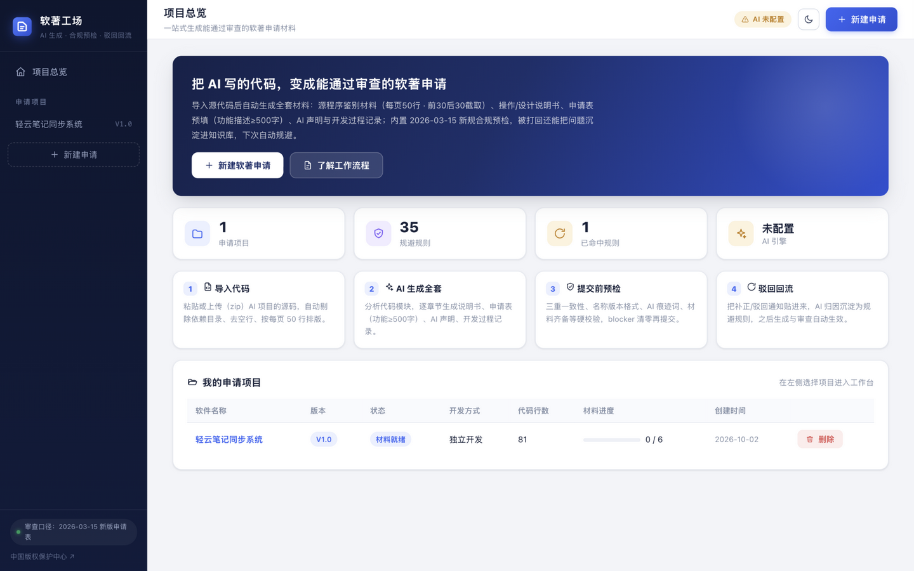
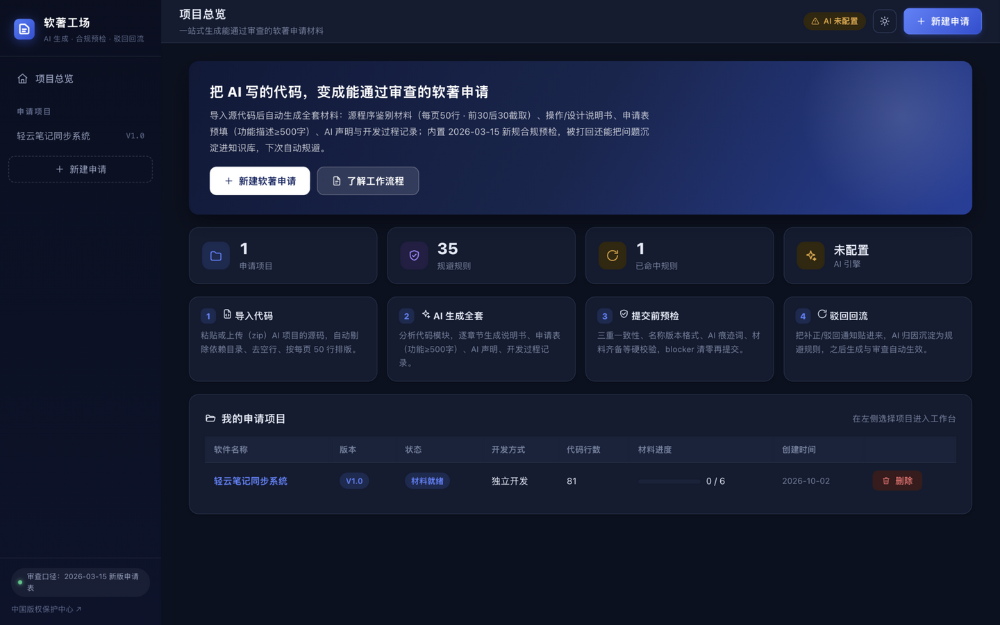
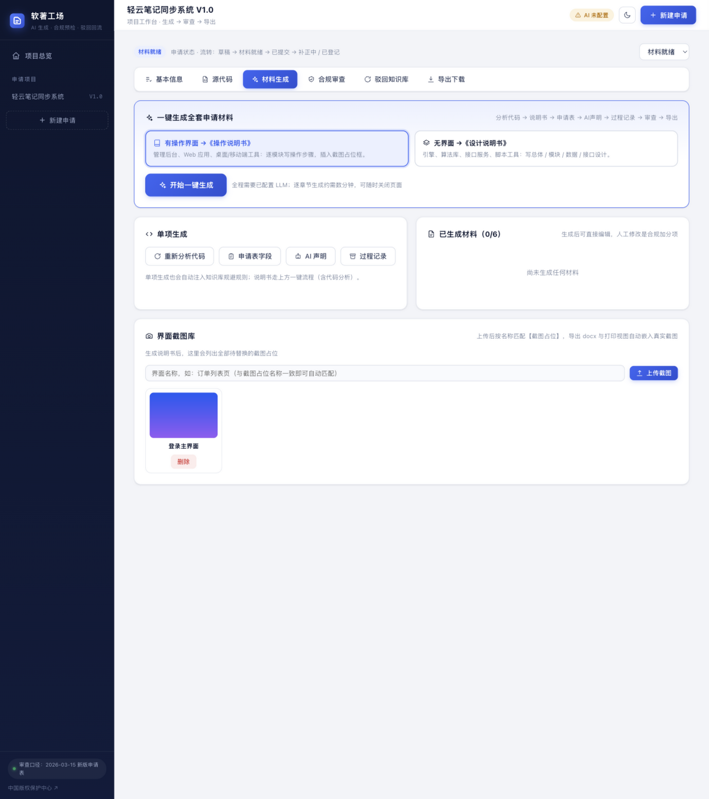
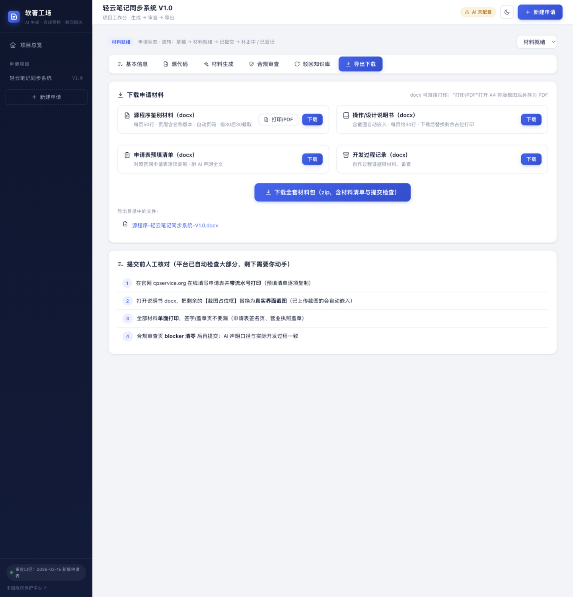
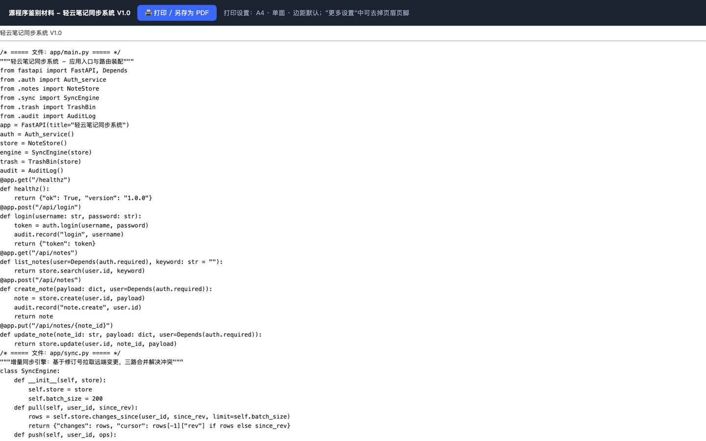

# 软著工场 · 软著申请辅助平台

一站式把 AI 生成的代码变成**能通过中国版权保护中心审查**的软著申请材料：
源程序鉴别材料（docx）→ 操作/设计说明书（docx）→ 申请表预填（docx）→ AI 声明 → 开发过程记录 → 合规预检 → 截图嵌入 → 全套打包下载 → 打印/PDF。



## 为什么是它

2026-03-15 起中国版权保护中心启用新版申请表与 AI 声明制度，补正率超 60%。本平台把申请做成**可复用的工程流水线**，而不是一次性模板：

| 模块 | 说明 |
|---|---|
| 源代码文档引擎 | 自动剔除依赖目录、去空行、每页精确 50 行、超 60 页按"前30+后30"截取、末页即程序结束页；页眉自动写入"软件全称 版本号"+ 右上角自动页码 |
| AI 材料生成 | 代码结构分析 → 逐模块生成操作说明书（含截图占位）或设计说明书（无界面软件）；申请表功能描述≥500字；AI 声明按"AI辅助+人类实质性创作"口径生成；开发过程记录（可基于 git log 还原时间线） |
| 合规审查引擎 | 内置 2026-03-15 新规硬校验：三重一致性、名称/版本格式与禁用词、AI 痕迹词、TODO 残留、行数/页数、日期逻辑、材料齐备；LLM 软审查（可选）：代码 AI 味、说明书套话检测 |
| 驳回知识库（核心壁垒） | 出厂自带 35 条高频补正/驳回规则；被打回后把补正通知贴进来 → AI 归因拆解为规则 → 可正则的规则自动进审查引擎（含"不少于N字"长度规则），其余注入全部生成 prompt → 下次自动规避 |
| 截图库 + 自动嵌图 | 上传界面截图并命名 → 导出 docx 与打印视图时自动匹配【截图占位】嵌入真实截图（精确/包含匹配），剩余占位保留虚线框 |
| 材料在线编辑 | AI 生成后可直接在平台编辑说明书/过程记录正文并保存，导出与打印即时生效——人工实质性修改本就是新规下的必要动作 |
| 申请状态跟踪 | 草稿 → 材料就绪 → 已提交 → 补正中 / 已登记 / 已驳回，批量管理多件申请 |
| 打印 / PDF 视图 | 每类材料的 A4 排版 HTML（与 docx 同一排版口径），浏览器"打印 → 另存为 PDF"零依赖获得 PDF 版 |
| 一键全套流水线 | SSE 实时进度：分析 → 说明书 → 申请表 → AI声明 → 过程记录 → 审查 → docx 导出 + zip 打包 |

## 界面

| | |
|---|---|
|  |  |
|  |  |

## 快速开始

```bash
python3 -m venv .venv
.venv/bin/pip install -r backend/requirements.txt
cp .env.example .env        # 填入 LLM_API_KEY 后可使用 AI 生成（不填仍可用格式引擎与硬校验）
./start.sh                  # 启动后打开 http://127.0.0.1:8310
```

Docker：

```bash
cp .env.example .env        # 写入 LLM_API_KEY
docker compose up -d        # http://localhost:8310，data/ 与 exports/ 已挂载持久化
```

## LLM 配置（.env）

任何 OpenAI 兼容接口均可：

```ini
LLM_BASE_URL=https://open.bigmodel.cn/api/paas/v4   # GLM；DeepSeek: https://api.deepseek.com/v1
LLM_API_KEY=你的key
LLM_MODEL=glm-4-flash                                # DeepSeek: deepseek-chat
```

未配置 LLM 时：源代码引擎、合规硬校验、知识库（关键词兜底归因）、截图库、全部 docx 导出与打印视图照常可用；AI 生成类功能（说明书/申请表/AI声明/LLM软审查）会给出明确提示。

## 使用流程（对"只会 AI 写代码"的人）

1. **新建申请**：填软件全称（以"系统/软件/平台"结尾）、版本 V1.0、开发完成日期；
2. **源代码**：把 AI 项目的源码整个 zip 上传（自动剔除 node_modules/dist 等），页面会显示"将提交页数"；
3. **材料生成**：选《操作说明书》（有界面）或《设计说明书》（无界面），一键生成全套；
4. **截图库**：按说明书里的【截图占位】名称上传界面截图，导出时自动嵌入；
5. **人工编辑**：在"材料生成"页直接编辑生成结果，补上你真实的设计细节；
6. **合规审查**：blocker 清零再提交；提醒项逐条处理；
7. **导出下载**：docx 单项下载或"全套材料包 zip"（含《材料清单与提交检查.txt》）；需要 PDF 时点"打印/PDF"；
8. **人工必做**：官网 cpservice.org 在线填表打印（带流水号）、核对截图清晰无水印、单面打印签字盖章；
9. **如果被打回**：把补正通知原文贴到"驳回知识库"页 → AI 归因沉淀规则 → 下次申请自动规避。

## 架构

```
ruanzhu-platform/
├── backend/app/
│   ├── config.py            # 配置（.env）
│   ├── database.py          # SQLAlchemy ORM 数据层（项目/源码/材料/截图/规则/报告）
│   ├── llm.py               # OpenAI 兼容客户端（重试/JSON稳健解析）
│   ├── main.py              # FastAPI 入口 + 前端托管
│   ├── routers/
│   │   ├── projects.py      # 项目 CRUD / 源码导入 / 状态流转
│   │   ├── generate.py      # SSE 生成 / 材料编辑（PUT doc）
│   │   ├── review.py        # 审查 + 知识库
│   │   ├── shots.py         # 界面截图库（上传/列表/删除/读取）
│   │   └── export.py        # docx 导出 / 打包 / 打印视图
│   └── services/
│       ├── code_engine.py   # 源码清洗/分页/结构分析
│       ├── docx_engine.py   # 鉴别材料排版（50行/页眉/页码/截图嵌入）
│       ├── review_engine.py # 硬校验+LLM软审查+知识库规则执行
│       ├── kb_service.py    # 驳回归因→规则沉淀→规避注入
│       ├── seed_kb.py       # 内置 35 条种子规则
│       ├── pipeline.py      # 一键全套流水线（SSE）
│       ├── print_view.py    # A4 打印视图（浏览器存 PDF）
│       ├── prompts.py       # 全套 prompt 模板（注入知识库规避清单）
│       └── exporter.py      # docx 导出与打包
├── frontend/                # 原生 SPA（无构建依赖，亮/暗双主题）
├── standalone/index.html    # 单文件预览版（双击可看界面骨架）
├── tools/build_standalone.py
├── backend/tests/           # pytest 单元测试（引擎/审查/知识库/截图/打印）
├── data/                    # SQLite（WAL）与截图库
└── exports/project_<id>/    # 导出的材料与材料包
```

API 自带交互文档：启动后访问 `/docs`（Swagger UI）。

## 测试与 CI

```bash
cd backend && ../.venv/bin/python -m pytest tests/ -q
```

24 个单元测试覆盖：源码清洗与分页（50行/前30后30/末页结束符）、JSON 稳健解析、知识库三种规则模式（forbid/match/min_length）、docx 页眉与截图嵌入、打印视图渲染、35 条种子规则结构校验。GitHub Actions 在每次 push 时跑测试 + 启动冒烟。

## 合规边界（重要）

平台定位是「AI 辅助开发 + 人类实质性创作」的**合规化与证据化**，不做"把纯 AI 代码伪装成人工编写"。纯 AI 生成材料直接提交属于 2026 新规 8 类非正常申请之一（"AI冒充自研"），会被直接驳回并可能列入失信名单。请对核心代码做真实的人工修改（平台审查会帮你识别 AI 痕迹），如实填写 AI 声明，并保留 Git 记录等过程证据。

## 风险与节奏提醒

- 同一主体单日提交建议 ≤3 件，避免触发"非正常申请"批量预警；
- 每件材料的功能描述与说明书必须基于该软件真实代码差异化生成（流水线已按代码分析生成，不要人工套模板）；
- 最终审查结果以中国版权保护中心为准，平台预检是降低补正概率的前置手段。

## License

MIT
